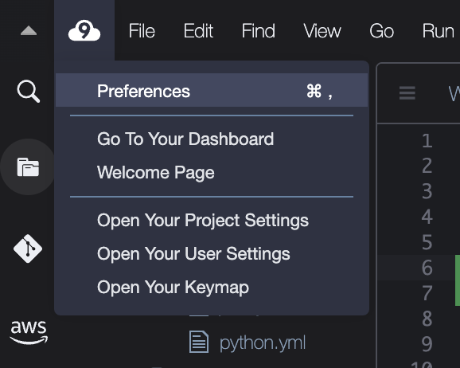
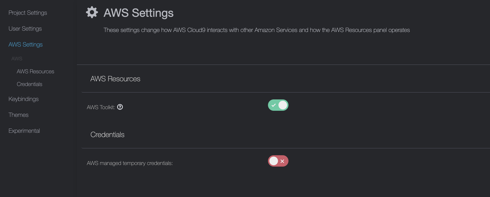

# Cloud 9 tools

# Hvordan øke diskplass til Cloud 9 

Det kan være en god idé å være proaktiv og øke lagringsplassen i Cloud9-miljøet. Dette kan oppnås ved hjelp av to kommandoer. 

Denne kommandoen utvider størrelsen på disken til EC2-instansen som Cloud9 kjører på til 20GB fra 10GB

```shell
aws ec2 modify-volume --volume-id $(aws ec2 describe-volumes --region $(curl -s http://169.254.169.254/latest/meta-data/placement/availability-zone | sed 's/[a-z]$//') --filters Name=attachment.instance-id,Values=$(curl -s http://169.254.169.254/latest/meta-data/instance-id) --query "Volumes[*].VolumeId" --output text) --size 20     
```

Denne andre kommandoen sørger for at operativsystemet har tilgang til den utvidede diskplassen.
```
sudo growpart /dev/nvme0n1 1
```

Det kan ta 10-20 minutter før du har mer plass, du kan gjøre en re-boot av EC2-Instansen hvis det ikke skjer av seg selv. 

# Om rettigheter i Cloud 9 

Når du åpner Cloud9 miljøet ditt, vil du få tildelt et lite sett med rettigheter som gir deg tilgang til de vanligste AWS tjenestene. 
Hvis du skal jobbe med andre tjenester, er det best å jobbe med sine egne IAM nøkler tilknyttet sin egen bruker. 

Jeg vil anbefale å opprette nøkler for din IAM bruker og kjøre ```aws configure``` fra Cloud9 i terminalen for å jobbe  
som en egen bruker.

Deretter gjør dere følgende i Cloud 9 - 



Finn AWS Settings, og slå AV AWS managed temporary credentials. 



Deretter kan du kjøre kommandoen 

```aws configure``` og bruke Security Credentials du har laget for din IAM bruker 
